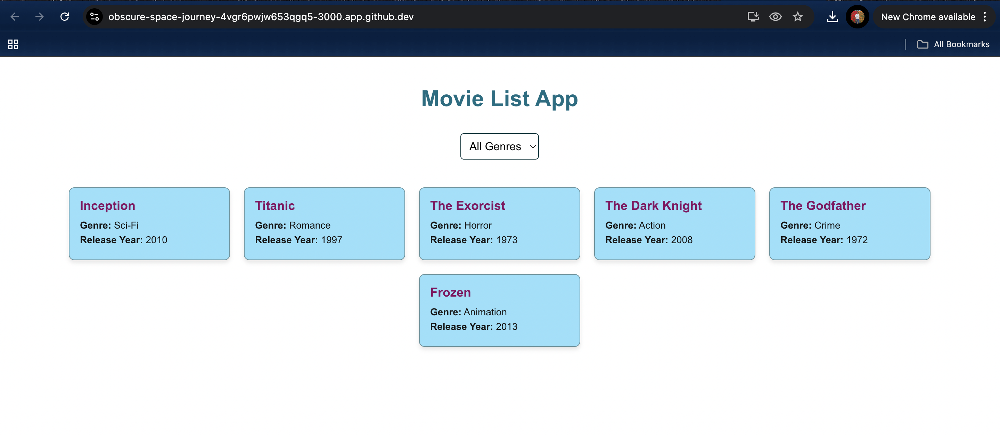
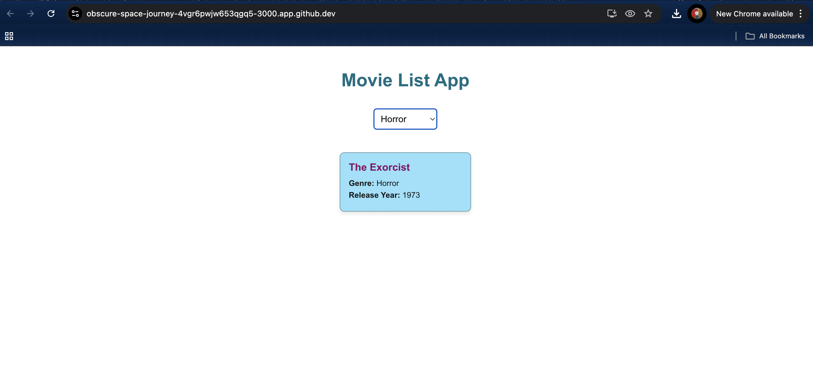
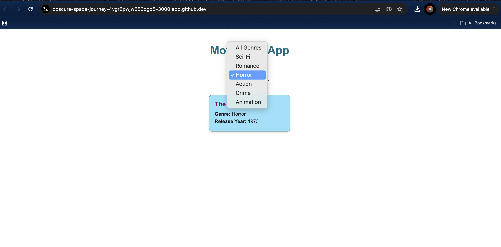
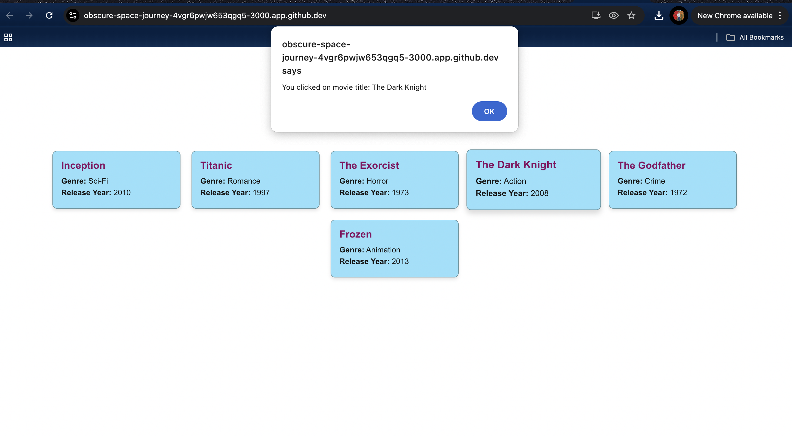

# CS628_PE02_Kritthika_Shanmugam
## Input
The app uses a predefined array of movies with attributes: title, genre, and release year. I used different geners here. We can interact via a dropdown menu to filter movies by genre. On cicking on a movie title triggers an alert displaying the movie's title. The dropdown includes genres dynamically generated from the movie list."All Genres" in the dropdown resets the list to show all movies.
## Process
I worked on Movielist app to built using React with functional components and hooks (useState). Movies are rendered as styled cards with their title, genre, and release year. The movies can be filtered by genre using a dropdown menu. The handleMovieClick function is used to display an alert with the movie title when a card is clicked. Filtering is managed by the selectedGenre state, which dynamically updates the displayed movies based on the selected genre. Unique genres are extracted using a Set to ensure no duplicates in the dropdown. 

## Output
As, mentioned in Pe02, the app displays a list of movies as visually appealing cards. A dropdown menu allows users to filter movies by genre or view all.  This shows alerts that the title of any movie clicked by the user. Responsive design ensures usability on different screen sizes.

